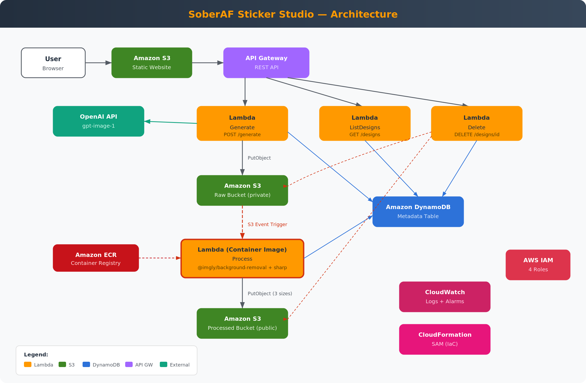

# SoberAF Sticker Studio

**AI-powered sticker design pipeline for [SoberAFStickers.com](https://soberafstickers.com)**

An event-driven, serverless application on AWS that generates custom sticker designs using AI (DALL-E 3), automatically processes them into multiple print-ready sizes, and serves a gallery interface for browsing and downloading designs.



---

## Problem & Use Case

As the owner of SoberAFStickers.com, I needed a faster way to go from sticker *idea* to print-ready *design files*. Previously, each design required manual creation, resizing, and formatting — a slow process that limited how quickly I could expand my catalog.

**SoberAF Sticker Studio** solves this by automating the entire pipeline: I type a sticker idea, AI generates the artwork in my brand's style, and the system automatically produces print-ready files in multiple sizes. What used to take hours now takes seconds.

## Tech Stack

| Service | Role | Why I Chose It |
|---------|------|----------------|
| **AWS Lambda** (Primary Compute) | Three functions: generate, process, list designs | Scales to zero when idle, pay-per-use, perfect for an event-driven pipeline |
| **Amazon S3** (Supporting Service) | Raw image storage, processed image storage, static frontend hosting | Versatile, cheap, triggers Lambda on upload, built-in static hosting |
| **Amazon API Gateway** | REST API connecting frontend to Lambda | Managed API layer with built-in throttling and CORS |
| **Amazon DynamoDB** | Design metadata (prompts, status, timestamps) | Serverless, fast, pay-per-request, no schema management |
| **AWS CloudFormation (SAM)** | Infrastructure as Code | Entire stack defined in one template, reproducible deployments |
| **Amazon CloudWatch** | Monitoring, logging, error alarms | Native integration with Lambda, actionable alerts |
| **AWS IAM** | Security — least-privilege roles per function | Each Lambda gets only the permissions it needs, nothing more |

## Architecture

```
User → S3 Static Site → API Gateway → Lambda (Generate)
                                            ↓
                                    OpenAI DALL-E 3 API
                                            ↓
                                    S3 Raw Bucket → (trigger) → Lambda (Process)
                                            ↓                        ↓
                                    DynamoDB ← ─ ─ ─ ─ ─ ─ ─  S3 Processed Bucket
                                            ↓
                                    Frontend Gallery (S3)
```

### How It Works

1. **Submit a prompt** through the web UI (hosted on S3)
2. **API Gateway** routes the request to the **Generate Lambda**
3. The Generate Lambda prepends the SoberAF house style to your prompt and calls **DALL-E 3**
4. The raw AI-generated image is stored in the **S3 raw bucket**
5. The S3 upload automatically triggers the **Process Lambda**
6. The Process Lambda resizes the image into three print-ready sizes (2"×2", 3"×3", 4"×4"), adds a subtle watermark, and stores results in the **S3 processed bucket**
7. Metadata is tracked in **DynamoDB** throughout the pipeline
8. The **frontend gallery** displays all designs with download links

## Setup & Deployment

### Prerequisites

- AWS account with CLI configured
- AWS SAM CLI installed
- Node.js 20+
- OpenAI API key (for DALL-E 3)

### Deploy the Stack

```bash
# Clone the repository
git clone https://github.com/dliloia/sober-af-sticker-studio.git
cd sober-af-sticker-studio

# Install dependencies
cd src/generate && npm install && cd ../..
cd src/process && npm install && cd ../..

# Deploy with SAM
cd infra
sam build
sam deploy --guided \
  --parameter-overrides OpenAIApiKey=YOUR_OPENAI_KEY

# Upload the frontend (update API_BASE_URL in index.html first)
aws s3 sync ../src/frontend/ s3://YOUR-FRONTEND-BUCKET-NAME
```

### After Deployment

1. Copy the API Gateway URL from the CloudFormation outputs
2. Update `API_BASE_URL` and `PROCESSED_BUCKET_URL` in `src/frontend/index.html`
3. Re-upload the frontend to S3
4. Open the Frontend URL from the CloudFormation outputs

## Security

- **IAM Roles**: Each Lambda function has its own IAM role with least-privilege permissions
  - Generate Lambda: can only write to raw S3 bucket and put items in DynamoDB
  - Process Lambda: can only read from raw bucket, write to processed bucket, and update DynamoDB
  - List Designs Lambda: can only scan DynamoDB (read-only)
- **S3 Bucket Policies**: Raw bucket is private; processed and frontend buckets allow public read
- **API Key Management**: OpenAI API key passed as a CloudFormation parameter with `NoEcho: true`
- **Encryption**: S3 buckets use AES-256 server-side encryption

## Cost Analysis

| Resource | Free Tier | Estimated Monthly Cost |
|----------|-----------|----------------------|
| Lambda (3 functions) | 1M requests + 400K GB-sec | $0.00 (well within free tier) |
| S3 (3 buckets) | 5 GB storage | $0.00 - $0.05 |
| DynamoDB | 25 GB + 25 read/write units | $0.00 (pay-per-request, minimal usage) |
| API Gateway | 1M API calls | $0.00 (within free tier) |
| CloudWatch | Basic monitoring free | $0.00 |
| **OpenAI DALL-E 3** | N/A (external) | ~$0.04 per image generated |
| **Estimated Total** | | **$0.00 - $5.00/month** depending on usage |

## Monitoring

- CloudWatch Logs for all three Lambda functions
- CloudWatch Alarms configured for error thresholds on Generate and Process functions
- All function invocations include structured logging with design IDs for traceability

## Resource Cleanup

To tear down all resources:

```bash
# Empty the S3 buckets first
aws s3 rm s3://YOUR-RAW-BUCKET --recursive
aws s3 rm s3://YOUR-PROCESSED-BUCKET --recursive
aws s3 rm s3://YOUR-FRONTEND-BUCKET --recursive

# Delete the CloudFormation stack
sam delete --stack-name soberaf-sticker-studio
```

> **Note**: I've elected to keep this pipeline running as it serves a real business purpose for SoberAFStickers.com. The serverless architecture means idle costs are effectively $0.

## Screenshots

See the [screenshots/](screenshots/) folder for deployment and console screenshots.

## License

MIT
