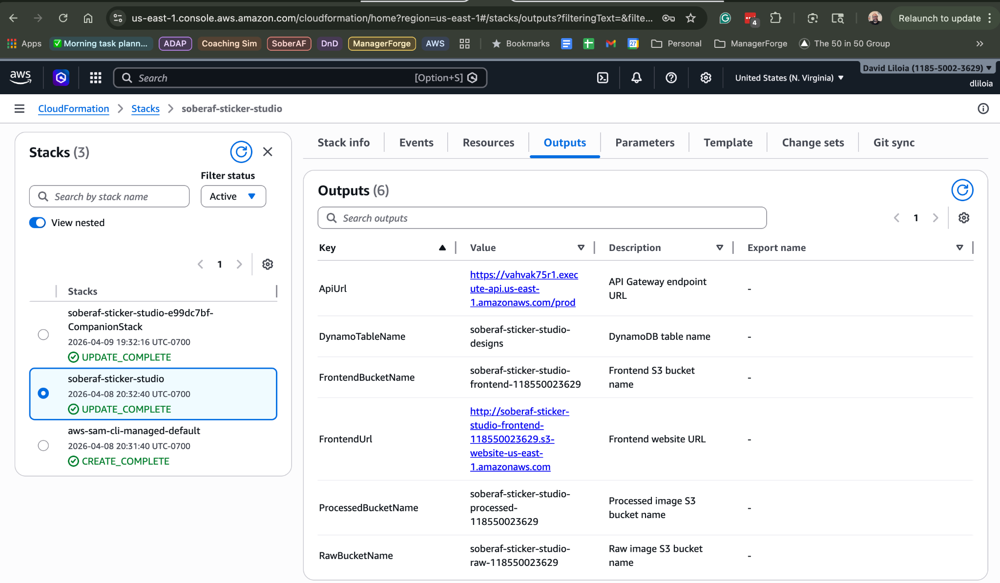
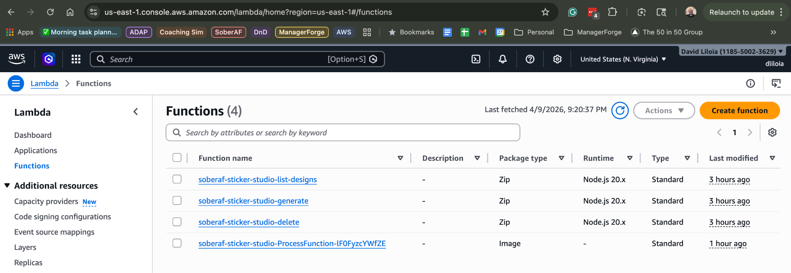
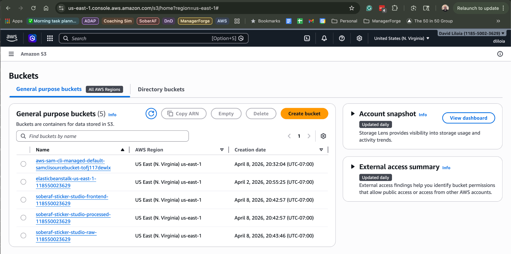
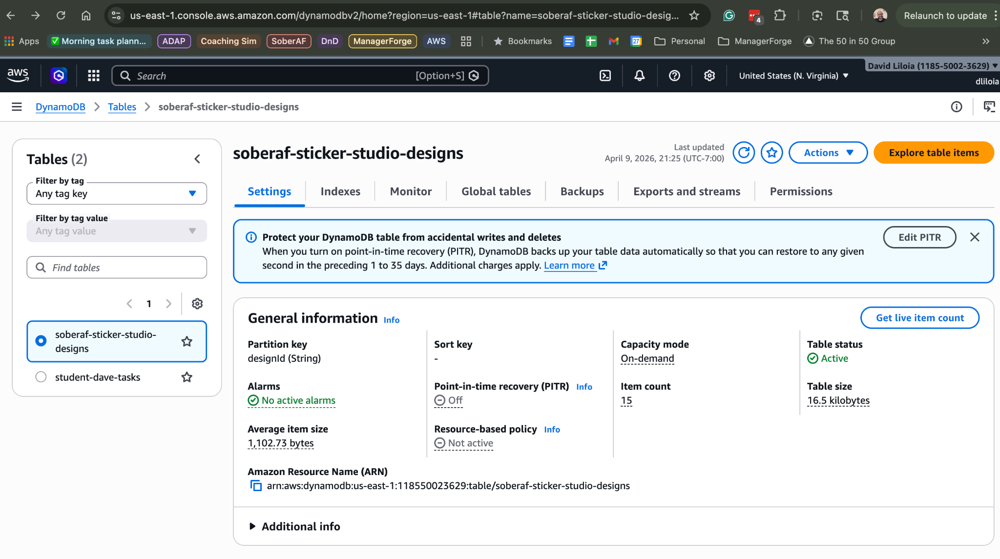
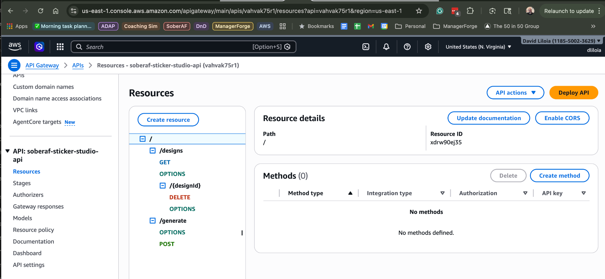
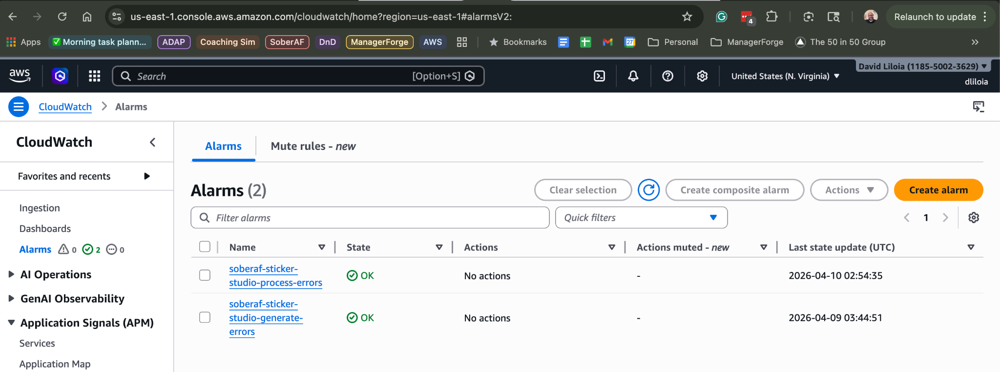
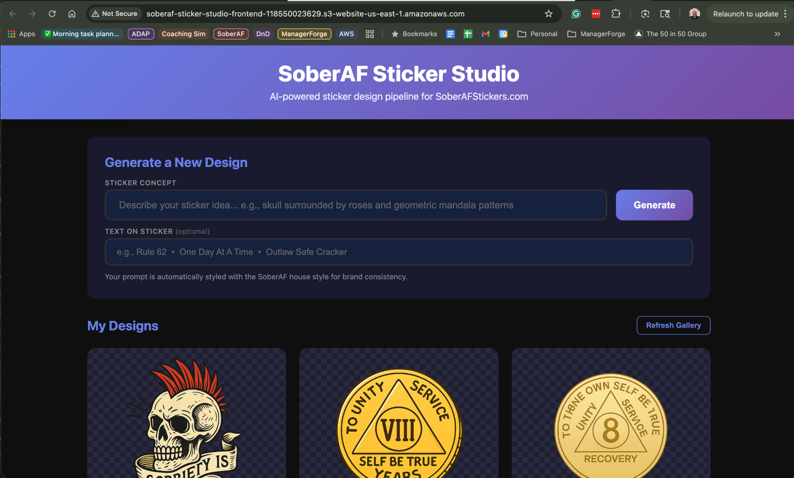
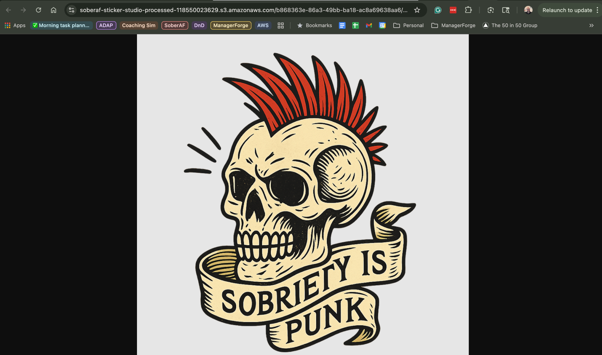

# SoberAF Sticker Studio

**AI-powered sticker design pipeline for [SoberAFStickers.com](https://soberafstickers.com)**

An event-driven, serverless application on AWS that generates custom sticker designs using AI (OpenAI `gpt-image-1`), automatically removes backgrounds with a U2-Net ML model, resizes them into multiple print-ready sizes, and serves a gallery interface for browsing and downloading designs.


---

## Problem and Use Case

As the owner of SoberAFStickers.com, I needed a faster way to go from sticker *idea* to print-ready *design files*. Previously, each design required an artist to hand-draw, manually remove backgrounds, and resize into multiple formats. A single sticker could take up to a week from concept to print-ready files.

**SoberAF Sticker Studio** solves this by automating the entire pipeline: I type a sticker idea, AI generates the artwork in my brand's style, a background-removal model cleans up the image, and the system automatically produces print-ready files in three sizes. What used to take a week now takes about thirty seconds.

## Tech Stack

| Service | Role | Why I Chose It |
|---------|------|----------------|
| **AWS Lambda** (Primary Compute) | Four functions: generate, process, list designs, delete | Scales to zero when idle, pay-per-use, perfect for an event-driven pipeline |
| **Amazon S3** (Supporting Service) | Raw image storage, processed image storage, static frontend hosting | Versatile, cheap, triggers Lambda on upload, built-in static hosting |
| **Amazon API Gateway** | REST API connecting frontend to Lambda | Managed API layer with built-in throttling and CORS |
| **Amazon DynamoDB** | Design metadata (prompts, status, timestamps) | Serverless, fast, pay-per-request, no schema management |
| **Amazon ECR** | Container registry for the Process Lambda image | Required for container-image-packaged Lambda functions |
| **AWS CloudFormation (SAM)** | Infrastructure as Code | Entire stack defined in one template, reproducible deployments |
| **Amazon CloudWatch** | Monitoring, logging, error alarms | Native integration with Lambda, actionable alerts |
| **AWS IAM** | Security: least-privilege roles per function | Each Lambda gets only the permissions it needs |

## Architecture

```
User > S3 Static Site > API Gateway > Lambda (Generate)
                                           |
                                   OpenAI gpt-image-1 API
                                           |
                                   S3 Raw Bucket > (S3 event trigger) > Lambda (Process)
                                                                             |
                                                                    @imgly/background-removal-node (U2-Net)
                                                                    sharp (resize to 3 sizes + watermark)
                                                                             |
                                   DynamoDB  < - - - - - - - - - - -  S3 Processed Bucket
                                       |
                               Frontend Gallery (S3)
```

### How It Works

1. **Submit a prompt** through the web UI (hosted on S3)
2. **API Gateway** routes the request to the **Generate Lambda**
3. The Generate Lambda prepends the SoberAF house style to your prompt and calls **OpenAI `gpt-image-1`** with `background: "transparent"`
4. The raw AI-generated PNG is stored in the **S3 raw bucket**
5. The S3 upload automatically triggers the **Process Lambda** (deployed as a container image via ECR)
6. The Process Lambda runs the image through **`@imgly/background-removal-node`** (a U2-Net ML model) for clean background removal, then uses **`sharp`** to resize into three print-ready sizes (2"x2", 3"x3", 4"x4" at 300 DPI) with a subtle "SoberAF" watermark
7. Processed images are stored in the **S3 processed bucket** and metadata is tracked in **DynamoDB**
8. The **frontend gallery** displays all designs with download links for each size
9. Designs can be **deleted** from the gallery if the quality isn't good enough

## Setup and Deployment

### Prerequisites

- AWS account with CLI configured
- AWS SAM CLI installed
- Docker Desktop (required for building the Process Lambda container image)
- Node.js 20+
- OpenAI API key

### Deploy the Stack

```bash
# Clone the repository
git clone https://github.com/dliloia/sober-af-sticker-studio.git
cd sober-af-sticker-studio

# Install dependencies
cd src/generate && npm install && cd ../..
cd src/process && npm install && cd ../..

# Build and deploy with SAM
# The --use-container flag builds the Process Lambda inside a Linux
# container so native binaries (sharp, onnxruntime) match Lambda's runtime.
cd infra
sam build --use-container
sam deploy \
  --parameter-overrides OpenAIApiKey=YOUR_OPENAI_KEY \
  --capabilities CAPABILITY_NAMED_IAM \
  --resolve-s3 \
  --resolve-image-repos

# Upload the frontend (update API_BASE_URL and PROCESSED_BUCKET_URL in index.html first)
aws s3 sync ../src/frontend/ s3://YOUR-FRONTEND-BUCKET-NAME
```

### After Deployment

1. Copy the API Gateway URL and bucket names from the CloudFormation outputs
2. Update `API_BASE_URL` and `PROCESSED_BUCKET_URL` in `src/frontend/index.html`
3. Re-upload the frontend to S3
4. Open the Frontend URL from the CloudFormation outputs

The first deploy takes ~5 minutes (building the container image). Subsequent deploys reuse Docker layer caching and are much faster.

## Security

- **IAM Roles**: Each Lambda function has its own IAM role with least-privilege permissions
  - Generate Lambda: can only write to raw S3 bucket and put items in DynamoDB
  - Process Lambda: can only read from raw bucket, write to processed bucket, and update DynamoDB
  - ListDesigns Lambda: can only scan DynamoDB (read-only)
  - Delete Lambda: can only delete from its specific resources
- **S3 Bucket Policies**: Raw bucket is fully private (all four BlockPublicAccess flags enabled); processed and frontend buckets allow public read through narrow bucket policies
- **API Key Management**: OpenAI API key passed as a CloudFormation parameter with `NoEcho: true`
- **Encryption**: All S3 buckets use AES-256 server-side encryption

## Cost Analysis

| Resource | Free Tier | Estimated Monthly Cost |
|----------|-----------|----------------------|
| Lambda (4 functions) | 1M requests + 400K GB-sec | $0.00 (well within free tier) |
| S3 (3 buckets) | 5 GB storage | $0.00 |
| DynamoDB | 25 GB + 25 read/write units | $0.00 (pay-per-request, minimal usage) |
| API Gateway | 1M API calls | $0.00 (within free tier) |
| ECR | 500 MB storage | $0.00 |
| CloudWatch | Basic monitoring free | $0.00 |
| **OpenAI gpt-image-1** | N/A (external) | ~$0.04 per image generated |
| **Estimated Total** | | **~$2.00/month** at ~50 designs/month |

## Monitoring

- CloudWatch Logs for all four Lambda functions
- CloudWatch Alarms on Generate and Process functions (fire at 3+ errors per 5-minute window)
- All function invocations include structured logging with design IDs for traceability
- CloudWatch Logs Insights for end-to-end pipeline tracing

## Resource Cleanup

To tear down all resources:

```bash
# Empty the S3 buckets first
aws s3 rm s3://YOUR-RAW-BUCKET --recursive
aws s3 rm s3://YOUR-PROCESSED-BUCKET --recursive
aws s3 rm s3://YOUR-FRONTEND-BUCKET --recursive

# Delete the ECR images
aws ecr batch-delete-image \
  --repository-name YOUR-ECR-REPO \
  --image-ids imageTag=latest

# Delete the CloudFormation stack
sam delete --stack-name soberaf-sticker-studio
```

> **Note**: I've elected to keep this pipeline running as it serves a real business purpose for SoberAFStickers.com. The serverless architecture means idle costs are effectively $0.

## Screenshots

| Screenshot | Description |
|-----------|-------------|
|  | CloudFormation stack outputs |
|  | Lambda console showing all four functions |
|  | S3 console with three buckets |
|  | DynamoDB metadata table |
|  | API Gateway routes |
|  | CloudWatch alarms |
|  | Frontend gallery |
|  | Generated sticker closeup |

See the [screenshots/](screenshots/) folder for all deployment and console screenshots.

## Demo Video

[Watch the demo on Loom](https://www.loom.com/share/063f5af1fc654162a357cbf67671d08c) (3-5 minutes): architecture walkthrough, live sticker generation, and AWS Console tour.

## Technical Report

The full technical report (PDF) is available at [docs/SoberAF-Sticker-Studio-Report.pdf](docs/SoberAF-Sticker-Studio-Report.pdf).

## License

MIT
